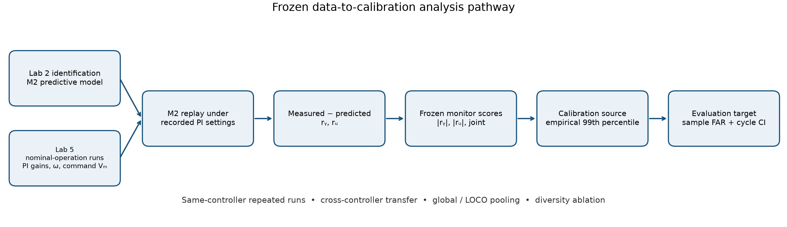
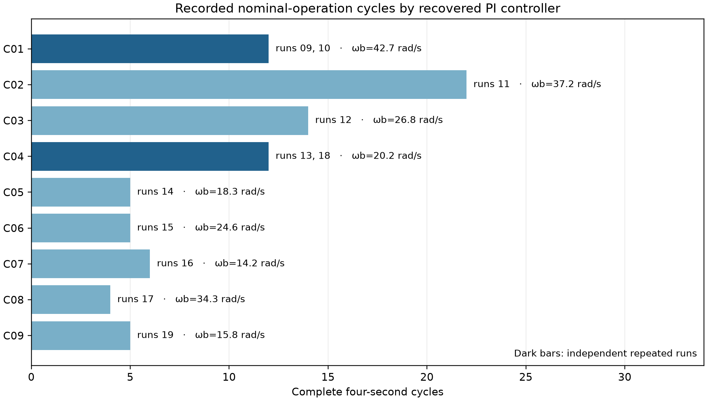
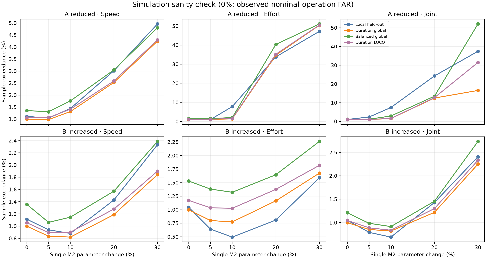

# Cross-Controller Validity of Residual-Monitor Calibration in a PI-Controlled DC Motor

*Manuscript Version 3 — restricted experimental pilot preprint. Author names, affiliations, venue, and submission details are intentionally omitted pending human review.*

## 1. Abstract

Residual monitors are typically calibrated under a nominal closed-loop configuration, yet controller settings may later change through commissioning or retuning. This study examines whether a monitor calibrated to a 1% nominal-operation sample-level false-alarm rate under one proportional–integral (PI) controller preserves that calibration under another controller on the same physical DC motor. Eleven archived nominal-operation runs (no documented deliberate fault; signal-quality screened; hardware health unverified) contain nine recovered PI configurations and 85 complete reference cycles. Speed and controller-commanded-voltage residuals are generated using a first-order predictive model calibrated exclusively from a separate Lab 2 identification record. Across 32 eligible controller-distinct transfers per channel, the largest effort-channel false-alarm rate reached 14.07% (95% cycle-bootstrap interval: 13.34–14.71%), whereas the maximum effort rate across the four available independent same-controller repeated-run directions was 1.39%. In a broader descriptive comparison, median absolute calibration error was 3.26–5.20 times larger for controller-distinct than for the four available same-controller cross-run directions, depending on channel. Controller-diverse calibration of nominal-operation data reduced several extreme unseen-controller false-alarm rates, although a secondary model-level simulation showed that conservative pooled thresholds could reduce exceedance sensitivity to selected gain changes. These results indicate limited calibration portability across PI configurations on the tested system. One motor and limited repeated-controller evidence preclude broader causal or real-fault detection claims.

## 2. Introduction

Residual-based monitoring compares observed behavior with a nominal model and evaluates departures against a decision threshold [1, 7–9]. Nominal-operation data commonly inform threshold selection in model-based and statistical process monitoring [9, 12, 13]. During commissioning, maintenance, software changes, or retuning, a PI controller may subsequently change while the monitor and its threshold remain fixed. The resulting closed-loop response may have a different nominal-operation residual distribution. A threshold calibrated under the original configuration can therefore yield either excessive or unusually few exceedances after a controller change.

Feedback can alter diagnostic signatures, mask deviations in regulated outputs, and move observable effects into controller effort [2, 3, 11]. Motor-drive research has shown that controller bandwidth affects signatures in speed and controller-side signals [4]. Those findings motivate a narrower empirical question: **How portable is the nominal-operation false-alarm calibration of an already-defined residual monitor across PI configurations on the same plant?** The present study asks that question on one physical laboratory DC motor. It does not test whether any particular fault can be detected experimentally.

The analysis uses an independently identified predictive motor model, recorded speed and controller-commanded voltage, and nine recovered PI settings. It freezes the residual scores and nominal 1% sample exceedance threshold before evaluating transfers. Independent repeated runs for two controller configurations provide a limited control for ordinary run/session variation. Pooled calibration and a small model-level sensitivity check are secondary analyses. Figure 1 outlines the data flow.

The paper makes three contributions:

1. We quantify the cross-controller portability of a fixed residual-monitor calibration across nine experimentally exercised PI configurations on the same DC motor and compare it with the available independent same-controller repeated-run evidence.
2. We characterise directional calibration failure through residual scale and upper-tail mismatch, showing why transfer from controller \(C_i\) to \(C_j\) need not resemble the reverse transfer.
3. We evaluate controller-diverse nominal-operation calibration as a robustness baseline and report the sensitivity cost in selected simulation-based degradation cases.

## 3. Related Work

**A. Closed-loop fault and residual monitoring.** Analytical redundancy, model-based residual generation, and residual evaluation are established parts of fault monitoring [1, 7–10]. Frank's survey [7], Chen and Patton's robust diagnosis treatment [8], and Ding's account of threshold determination and feedback systems [9] show that neither residual construction nor thresholding is new here. Blanke and colleagues place diagnosis within the wider closed-loop and fault-tolerant-control setting [10]. Our fixed residual monitor is an instrument for measuring *calibration portability*, rather than a proposed diagnostic algorithm or a test of known physical faults.

These foundations distinguish generating an informative residual from choosing a decision limit for it. A monitor can keep exactly the same residual generator and still lose its intended nominal-operation exceedance rate if the score distribution changes. The present experiment isolates that operational question by retaining the identified plant model, score definitions, quantile rule, and reference waveform while comparing archived PI configurations. It does not benchmark the many available observer, parity-space, or statistical detector designs.

**B. Controller-dependent diagnostic and fault signatures.** Feedback can mask an output deviation while compensating through the manipulated variable; controller effort may therefore carry diagnostic information [2]. Closed-loop feedback also affects residual modelling and fault attribution [3, 11]. Liu and colleagues examine observer-residual performance specifically under PI feedback [16], while Zhang and colleagues address small-fault information that closed-loop action can diminish [17]. In a permanent-magnet synchronous motor, Wei and colleagues found that loop bandwidth changes the distribution of signatures between speed and controller-side signals [4]. These papers motivate including speed and commanded-voltage residuals, while their faulted systems and methods differ from this nominal-operation DC-motor study. Our narrower question concerns the threshold of an already-defined monitor when only the PI configuration changes in archived nominal-operation data.

The previous studies support the possibility of controller-sensitive measurements; they do not imply that every controller change must spoil a nominal-operation threshold. Nor does a change in residual exceedance identify which physical feature of the loop caused it. Our controller descriptors and empirical score distributions are therefore used descriptively, with the limited repeated-run evidence kept separate from within-run cycle splits.

**C. Residual thresholds and false-alarm calibration.** Fixed decision limits can be sensitive to uncertainty in residual statistics. Adaptive and robust approaches have long been developed: Frank and Kiupel use fuzzy adaptive thresholds [5], Ding reviews systematic threshold determination [9], and Verdier and colleagues adapt change-detection thresholds to maintain false-alarm constraints under time-varying statistics [13]. Qin surveys normal-data statistical process monitoring [12]. Multi-mode monitoring has also motivated separate mode-sensitive thresholds, including the evidential-reasoning approach of Zhang and colleagues [14]. We make no claim to a new calibration method. Instead, we hold the score and empirical threshold rule fixed and measure its nominal-operation exceedance after cross-controller transfer on one plant.

This choice makes the interpretation narrow. Our 99th-percentile threshold is an empirical limit for a specified calibration set and score, not a bound guaranteed for every later configuration. The measured FAR refers to individual nominal-operation samples above that limit; it is not a per-cycle alarm probability. Treating a very low transferred FAR as automatically good would miss the possibility of a threshold too wide for the nominal target.

**D. Monitoring under distribution or domain shift.** Changes between calibration and deployment distributions can invalidate a fixed threshold's intended error rate. Adaptive conformal inference under distribution shift [6] and weighted conformal methods beyond exchangeability [15] are established alternatives; neither is implemented here, and their prediction-set guarantees do not apply to these dependent residual scores. Lv and colleagues explicitly address time-series anomaly-score threshold transfer under temporal covariate shift [18], using a different adaptive model. The multi-mode work [14] likewise addresses changing operating regimes by altering the monitoring procedure. The gap addressed here is more specific: empirical cross-controller portability of an already-defined *nominal-operation* residual-monitor calibration across multiple real PI configurations on the **same physical plant**. We neither claim that distribution-shift calibration is novel nor infer universal controller effects from this archive.

Pooling nominal-operation records from several controllers is one simple robustness baseline, not a substitute for adaptive, conditional, or mode-specific methods. Its advantage in this archive must be judged against unequal source durations and the possibility that a wider pooled score distribution suppresses exceedance under genuine deviations. This is why the paper reports both controller-balanced and duration-pooled calibration, and confines its sensitivity check to explicitly labelled model-level simulations.

## 4. Experimental System and Dataset

The archive contains one laboratory DC motor system with recorded angular speed, denoted \(\omega\), and controller-commanded voltage, denoted \(V_m\). **\(V_m\) is the saved voltage command, not an independently measured motor-terminal voltage.** The recorded PI gains and sample time are recovered from the experimental files; reference reconstruction and saved-voltage replay support the controller implementation used in the analysis. The reference alternates between 0 and 5 rad/s every two seconds, forming a four-second cycle at a 200 Hz sample rate. The predictive model starts from zero speed and reconstructs the sampled PI, command saturation, and limited integrator. Measured \(\omega\) and recorded \(V_m\) are kept distinct from simulated speed and predicted command.

An independent Lab 2 identification record provides the first-order motor form \(G(s)=A/(Bs+1)\). The original **undelayed M0 identification** yielded \(A=1.6985574034\) rad/s/V and \(B=0.07148396211\) s. After introducing a Lab-2-calibrated 14 ms **effective predictive delay**, the **Lab-2-only predictive fit was re-estimated**, yielding the M2 coefficients \(A=1.6927871691\) rad/s/V and \(B=0.05695897695\) s used in every primary monitoring analysis. No Lab 5 monitoring data were used to fit or tune M2. The delay summarizes the command-to-recorded-speed predictive path; it is not a verified physical actuator delay. M0 is retained only as a sensitivity ablation.

Lab 5 runs 09–19 form the primary **nominal-operation** set because they contain moving responses with finite signals and little saturation, with no deliberate fault documented. “Nominal-operation” denotes archived runs satisfying those signal-quality criteria and lacking a documented deliberate fault; it does **not** independently establish that the hardware was completely fault-free. Runs 01–08 are excluded for documented nonmoving, saturated, or otherwise abnormal behavior. The 11 included recordings contain nine PI configurations and 85 complete reference cycles. C01 and C04 each have two independent runs; the other seven configurations have one run each. Table 1 and Figure 2 show the calibration coverage. Run identities and controller mappings are included in the public processed metadata; original source hashes remain in the private data freeze.

**Table 1. Recovered PI configurations and included data.** Gains and predicted closed-loop bandwidth are archived descriptors; bandwidth is not a measured causal variable.

| Controller | \(K_p\) | \(K_i\) | Predicted bandwidth (rad/s) | Included runs | Complete cycles |
|---|---:|---:|---:|---|---:|
| C01 | 1.0950 | 35.3543 | 42.68 | 09, 10 | 12 |
| C02 | 1.0950 | 27.6959 | 37.19 | 11 | 22 |
| C03 | 0.7583 | 17.7254 | 26.76 | 12 | 14 |
| C04 | 0.5338 | 12.3093 | 20.16 | 13, 18 | 12 |
| C05 | 0.5338 | 10.9659 | 18.29 | 14 | 5 |
| C06 | 0.7583 | 15.7908 | 24.64 | 15 | 5 |
| C07 | 0.3734 | 8.0566 | 14.16 | 16 | 6 |
| C08 | 0.7583 | 25.8154 | 34.26 | 17 | 4 |
| C09 | 0.3734 | 9.0436 | 15.80 | 19 | 5 |

## 5. Residual Monitor and Calibration Protocol

For sample \(k\), let measured speed and saved controller command be \(\omega_k\) and \(V_{m,k}\), and let the M2 closed-loop predictor under the recorded PI gains give \(\widehat\omega_k\) and \(\widehat V_{m,k}\). The two residuals and scalar scores are

\[
r_{y,k}=\omega_k-\widehat\omega_k,\qquad r_{u,k}=V_{m,k}-\widehat V_{m,k},
\qquad s_{y,k}=|r_{y,k}|,\quad s_{u,k}=|r_{u,k}|.
\]

The joint residual vector is \(\mathbf r_k=[r_{y,k},r_{u,k}]^{\mathsf T}\). Its score is the Mahalanobis distance

\[
s_{J,k}=\sqrt{(\mathbf r_k-\boldsymbol\mu)^{\mathsf T}
\boldsymbol\Sigma^{-1}(\mathbf r_k-\boldsymbol\mu)}.
\]

The joint score is a robust Mahalanobis-type distance using componentwise-median centering, MAD-based scaling, fixed clipping, and covariance regularisation. The centre, covariance, and all score thresholds are fitted **only from the declared calibration cycles**. Exact clipping and ridge settings are given in Appendix D.

For an unseen-controller comparison, every cycle of the evaluation controller is withheld from these calibration operations, including the joint centre and covariance fit. The predictor coefficients remain those estimated on the separate Lab 2 record. The same frozen scoring definitions are then applied to the evaluation controller's measured speed and saved command. This separation matters because using the target controller's nominal-operation residual distribution, even only to refit joint-score geometry, would turn the assessment into a different calibration question.

For channel \(c\in\{y,u,J\}\), the frozen threshold \(T_c\) is the observed empirical 99th percentile of calibration scores, using the conservative higher-order quantile. The nominal target is a **1% sample-level exceedance rate**. On nominal-operation evaluation data \(E\), the reported false-alarm rate (FAR) is

\[
\widehat{\mathrm{FAR}}_c(E)=\frac{1}{N_E}\sum_{k\in E}\mathbf 1\{s_{c,k}>T_c\}.
\]

Every retained evaluation cycle contains 800 samples, so averaging its per-cycle sample fractions gives the same point estimate as pooling all evaluation samples. Because hardware health is unverified, FAR operationally denotes exceedance on the screened nominal-operation records. It is neither a cycle-level alarm probability nor an independent-event rate. Consecutive 5 ms samples are dependent and crossings may cluster. Complete four-second cycles, rather than individual samples, are the resampling units for bootstrap uncertainty. Cycle resampling preserves within-cycle dependence but cannot create independent motors or sessions. The target is calibration near the prescribed 1% exceedance fraction: both excessive FAR and an overly conservative rate near zero indicate miscalibration.

**Within-run** comparisons use disjoint chronological cycle portions from the same recording. **Same-controller cross-run** comparisons fit on one independent recording and evaluate on another recording with the same PI configuration. **Cross-controller** comparisons fit on cycles of one PI configuration and evaluate on a different configuration. The primary pairwise matrix admits C01–C04 as full calibration sources because each has at least ten complete cycles; all nine controllers can be evaluation targets. Diagonal matrix cells use leave-one-run-out validation when a controller has repeated runs and leave-one-cycle-out validation for singleton controllers. A fixed **global** pool includes all nine controllers, including the evaluation controller, and is therefore optimistic. **Leave-one-controller-out (LOCO)** pooling excludes every cycle of the evaluation controller. Duration pooling includes all cycles of each source; controller-balanced pooling selects the same number of cycles per source. These distinctions determine which numerical comparisons can be interpreted as unseen-controller evidence.

## 6. Cross-Controller Calibration Transfer

Figure 3 gives the full-range transfer matrices for speed, effort, and joint scores. Rows are calibration controllers and columns are evaluation controllers. Off-diagonal cells use a threshold fitted on a different controller. Dark, near-zero cells are retained: a low nominal-operation exceedance rate may reflect an over-wide threshold and is not, by itself, successful 1% calibration. Table 2 summarizes the 32 controller-distinct transfers per channel.

**Table 2. Primary controller-distinct transfer results at a nominal 1% sample FAR.** Thirty-two off-diagonal source–target cells contribute to each row.

| Score | Median FAR | 95th percentile FAR | Maximum FAR | Maximum absolute error from 1% |
|---|---:|---:|---:|---:|
| Speed \(|r_y|\) | 0.50% | 2.37% | 2.58% | 1.58 percentage points |
| Effort \(|r_u|\) | 0.03% | 7.76% | 14.07% | 13.07 percentage points |
| Joint distance | 0.66% | 3.47% | 4.24% | 3.24 percentage points |

The largest effort rate is C04→C01: a C04 threshold fitted on 12 cycles from runs 13 and 18 yields 14.07% sample exceedance on 12 C01 cycles from runs 09 and 10. Its complete-cycle bootstrap interval is 13.34–14.71%; the source effort-threshold bootstrap coefficient of variation is 1.94%. Subselecting 3, 5, 7, or 10 of the 12 C04 calibration cycles leaves the median C01 effort FAR near 14%, so the result is not explained solely by one full-pool threshold estimate.

Transfer is directional. The reverse C01→C04 effort rate is 0%; the direction with fewer alarms is also miscalibrated relative to a 1% target and may be less responsive to changes. C04→C01 gives the maximum primary speed and joint rates as well, 2.58% and 4.24%. Other cells vary in both directions, and the reused controllers and runs make matrix cells dependent. No population-level transfer probability is estimated.

The qualitative cross-controller miscalibration finding was also checked with nominal sample-FAR targets of 0.5%, 1%, 2%, and 5%. At all four targets, the worst effort-channel transferred FAR exceeded the prescribed rate; Appendix C gives the frozen ablation values. This is a robustness check of the same monitor, not a separate experiment.

## 7. Same-Controller Run Variability and Robustness Analysis

Only C01 and C04 permit independent same-controller repeated-run comparisons. C01 uses runs 09 and 10; C04 uses runs 13 and 18. For each pair, a threshold fitted on one entire run is evaluated on the other, then the direction is reversed. Table 3 lists every direction and channel. Within-run cycle splits are a separate category and do not count as independent repeated-run evidence.

The C01 repeated-run comparison is asymmetric in calibration support: **run 09 contains only two complete reference cycles**, so the 09→10 threshold estimate is substantially less supported than the reverse 10→09 direction. This limits how strongly the available same-controller repeated-run evidence can be interpreted.

**Table 3. Independent same-controller run-to-run sample FAR.** C01 contributes runs 09 and 10; C04 contributes runs 13 and 18.

| Controller | Calibration → evaluation run | Calibration / evaluation cycles | Speed FAR | Effort FAR | Joint FAR |
|---|---|---:|---:|---:|---:|
| C01 | 09 → 10 | 2 / 10 | 1.2875% | 1.3875% | 1.3750% |
| C01 | 10 → 09 | 10 / 2 | 0.7500% | 0.6875% | 0.6875% |
| C04 | 13 → 18 | 6 / 6 | 0.9583% | 1.2917% | 1.1250% |
| C04 | 18 → 13 | 6 / 6 | 1.0000% | 0.7292% | 0.9583% |

The maxima across these directions are 1.29% for speed, 1.39% for effort, and 1.38% for the joint score. **As a descriptive archive-level summary**, median absolute calibration error across the 106 directed controller-distinct **run-to-run** comparisons was 5.20, 3.31, and 3.26 times the corresponding median across the **four available same-controller cross-run directions** for speed, effort, and joint scores, respectively. This contrast is distinct from the 32-cell primary controller-level matrix. The 106 directions are **not 106 independent experiments**: many reuse the same archived runs and controllers. Figure 4 shows category distributions, including within-run splits. The available same-controller repeated-run evidence is consistent with a controller-associated difference on this motor, while controller identity and session chronology remain partly confounded.

## 8. Distributional Basis of Directional Transfer Failure

A source threshold \(T_i\) is a quantile of source scores. Its transferred FAR is the fraction of target scores above that same threshold. Thus \(\widehat{\mathrm{FAR}}_{i\rightarrow j}\) can differ from \(\widehat{\mathrm{FAR}}_{j\rightarrow i}\) whenever the two score distributions and their upper quantiles differ. This is a direct property of the threshold operation, not a new probability theorem. Figure 5 places C04 and C01 scores in each source model's coordinate system and shows the source threshold in both directions.

For C04→C01 effort, the target/source MAD ratio is 2.39 and the corresponding 99th-percentile ratio is 2.42. The descriptive Wasserstein distance between the source and target effort-score distributions is 0.0933 V; the empirical KS statistic is 0.4225. The source C04 effort threshold is 0.3824 V. Under C01 calibration, the reverse threshold is wider, approximately 0.9260 V, and no C04 effort samples exceed it. Speed shows a more concentrated upper-tail difference: the C04 and C01 99th percentiles are approximately 0.4780 and 0.7491 rad/s in the C04 score coordinate. The observed directional transfer is consistent with a distributional basis involving both robust-scale and upper-tail mismatch; these patterns do not identify a physical cause.

Several controller-distance descriptors were descriptively associated with calibration error, but the limited number of independent controller sources precludes predictive or causal interpretation. Detailed rank correlations are given in Appendix D.

## 9. Controller-Diverse Calibration

A calibration threshold can be formed from nominal-operation cycles under several PI configurations rather than one. Table 4 compares the frozen primary single-source transfer with four pooled baselines. The global baselines include the evaluated controller and therefore cannot establish unseen-controller validity. LOCO explicitly excludes it. Duration pooling uses all available source cycles, whereas the global balanced baseline uses an equal cycle count per controller. The single-source row covers 32 controller-distinct pairs; each pooled row covers nine evaluation controllers, so row maxima describe different comparison populations.

**Table 4. Worst observed nominal-operation sample FAR for calibration strategies.** Single-source and pooled rows have different evaluation populations, as indicated.

| Calibration strategy | Evaluation condition | Speed | Effort | Joint |
|---|---|---:|---:|---:|
| Single-controller source transfer | Different controller; 32 directed pairs | 2.58% | 14.07% | 4.24% |
| Duration-pooled global | Nine controllers, each included in calibration | 1.80% | 2.34% | 1.75% |
| Controller-balanced global | Nine controllers, each included in calibration | 2.26% | 3.48% | 1.98% |
| Duration-pooled LOCO | Nine unseen evaluation controllers | 1.85% | 2.72% | 1.86% |
| Controller-balanced LOCO | Nine unseen evaluation controllers | 2.39% | 3.84% | 2.24% |

The controlled diversity ablation compares every subset of one through eight source controllers and evaluates only controllers absent from that subset. For the controller-balanced condition, each selected source contributes four randomly selected complete cycles. Forty selections are made; a subset–target cell is summarized by its median selection FAR, after which medians, 95th percentiles, and maxima are computed across subset–target cells. Increasing source diversity from one to eight controllers reduces the **worst unseen-controller cell median** from 3.93% to 2.30% for speed, 45.86% to 3.76% for effort, and 36.53% to 2.14% for the joint score. These are archive-specific reductions, not guarantees of nominal 1% calibration.

The 45.86% one-source effort cell is C07→C03: it calibrates on four of C07's six cycles in each selection and evaluates C03's 14 cycles. It is **not directly comparable** with the 14.07% primary pairwise C04→C01 result, which uses all 12 C04 calibration cycles and admits only four sufficiently long source-controller records. The eligible source populations and calibration procedures differ.

For a matched weighting comparison at every diversity level, duration pooling fits on all cycles available from each chosen source, while controller balancing continues to use four selected cycles per source. Figure 6 shows the 95th-percentile and worst unseen-controller FAR for both. At eight sources, the duration-pooled worst effort FAR is 2.72% versus 3.76% for balanced pooling; corresponding joint values are 1.86% and 2.14%. Duration pooling often has the lower upper tail in this archive but is not uniformly superior in every subset and channel. It gives greater effective weight to controllers with longer archived records, whereas controller-balanced pooling gives each selected controller equal cycle weight. Neither weighting is established as universally preferable.

## 10. Simulation-Based Robustness–Sensitivity Sanity Check

The nominal-operation result raises a practical question: can a more conservative pooled threshold reduce false alarms while also suppressing threshold exceedance for a changed motor model? This secondary analysis is only a deterministic **simulation-based threshold-exceedance sensitivity** check. It does not constitute real-fault validation. Matched nominal and changed-parameter trajectories use the same recovered PI controller, reference, sample time, initial conditions, saturation, and M2 effective delay. The only changes are \(A_f=A(1-\alpha)\) or \(B_f=B(1+\beta)\), evaluated at 0%, 5%, 10%, 20%, and 30%. The paired simulated speed and command difference is added to the corresponding experimentally observed nominal-operation residual. The 0% point therefore equals the measured nominal-operation sample FAR; positive severities remain model-level overlays.

Four frozen calibration strategies are compared: local held-out controller-specific calibration, duration-pooled global, controller-balanced global, and duration-pooled LOCO. **In selected gain-reduction cases**, pooled thresholds substantially reduce simulation-based threshold-exceedance sensitivity. For example, at a 10% reduction in \(A\) for C07, effort-sample exceedance falls from 39.10% under local calibration to 0% under duration-pooled LOCO calibration. This is **illustrative and not a real fault-detection probability**. The overlay assumes that the archived nominal-operation residual remains additive to the simulated model change. Increasing \(B\) produces little additional exceedance under any strategy and sometimes reduces it relative to the nominal-operation baseline. That negative result is retained in Figure 7.

## 11. Discussion

The measured nominal-operation residual distributions on this motor make calibration portability an empirical question. A monitor can retain its plant model, residual definition, scores, and threshold while a changed PI configuration alters which nominal-operation samples exceed the threshold. The physical plant need not be changed for the closed-loop trajectories presented to the monitor to change. The C04→C01 and reverse effort transfers illustrate how the same pair can yield both high and near-zero FAR depending on direction. A 0% rate is not automatically preferable to 1%: it can indicate a threshold too conservative for the declared target. The evidence therefore supports treating the monitor's calibration as part of the **closed-loop deployment configuration**, alongside the controller gains and model version.

Pooling cycles from multiple controllers reduces some of the largest observed unseen-controller FARs. The benefit is clearest when moving from a single narrow source subset toward diverse sources in the controlled ablation. The resulting FAR still varies by target controller, and the global baseline is partly optimistic because it includes target-controller data. Duration and balanced pooling answer different weighting questions: one emphasizes the archive's observed duration mix, the other gives controllers equal representation. The record does not determine which would generalize better to a prospective deployment population. A broader calibration distribution can also increase a threshold, so false-alarm portability and responsiveness to deviations must be considered together rather than selecting the lowest observed nominal-operation FAR alone.

Operationally, this points to retaining the calibration population and controller settings as part of a monitor's configuration record. After a loop change, a nominal-operation recheck can establish whether the frozen threshold still delivers an acceptable sample-level exceedance fraction under the new setting. If a common threshold across settings is desired, the archive suggests testing it on controllers held out from calibration and specifying in advance how much nominal-operation FAR variation and simulated or experimental sensitivity loss is tolerable. The present data do not set those acceptance limits.

The secondary simulation illustrates that design tension: a threshold broad enough to reduce nominal-operation exceedance may not be crossed after a selected moderate model change. Its gain-reduction examples do not constitute fault validation, and the weak time-constant response is part of the finding. A practical calibration choice would require explicit alarm and sensitivity criteria tested on independent future data.

Commissioning, retuning, maintenance, or software updates that alter the loop can justify checking the nominal-operation score distribution again. Gain scheduling was not tested directly, so any extension to it remains a proposal for future work rather than an observed result. The archive does not establish that every controller change invalidates a monitor.

## 12. Limitations

This is a restricted pilot on **one physical DC motor** and nine archived PI configurations, not a sample of motors or industrial installations. Only C01 (runs 09 and 10) and C04 (runs 13 and 18) have independent repeated recordings. **C01 run 09 contains only two complete cycles**, so its 09→10 calibration threshold is much less supported than the reverse 10→09 threshold. This asymmetry further limits the repeated-run contrast. The four same-controller cross-run directions do not fully separate controller identity from session chronology, environmental changes, or other unrecorded conditions. Five controllers contribute only four to six complete cycles and are not accepted as full calibration sources in the primary pairwise matrix. Reuse of runs across matrix cells creates dependence between reported transfers.

The primary analysis uses archived nominal-operation data, not independently verified fault-free hardware. It contains **no experimentally injected physical faults** and cannot establish real fault-detection effectiveness, diagnosis, or a minimum detectable degradation. The saved \(V_m\) is controller-commanded voltage, not independently measured terminal voltage. The model is first-order and predictive; the 14 ms term is an effective predictive delay, not a measured physical actuator delay. Residual scale and tail descriptions do not isolate a physical cause. Controller-bandwidth associations are descriptive and partly confounded with PI gains and run order.

FAR is a **sample-level score exceedance fraction**. Adjacent samples are temporally dependent, and exceedances can cluster within a cycle. The complete-cycle bootstrap preserves within-cycle structure but does not remove dependence from reused runs and controllers or describe between-motor variability. A nominal 1% calibration quantile is not a per-controller, per-cycle, or independent-alarm guarantee. The diversity ablation changes the eligible source population and calibration size relative to the primary pairwise experiment; its larger one-source worst case should not be substituted for the pairwise maximum.

The secondary sanity check changes model parameters in matched **simulations only**. Adding the simulated trajectory difference to an archived nominal-operation residual assumes that recorded mismatch would remain additive under the change. Global calibration includes evaluation-controller nominal-operation data and is optimistic. Local held-out calibration for seven singleton controllers uses cycles from the same run. These design choices restrict the interpretation of simulated sensitivity comparisons. External generalization remains unestablished.

## 13. Conclusion

On the tested system, residual-monitor thresholds calibrated under one PI configuration did not transfer uniformly to other controller configurations. The largest primary effort FAR was 14.07% at a 1% nominal sample target, compared with at most 1.39% in the available independent same-controller repeated-run evidence. Directional residual scale and upper-tail differences accompanied the transfer failure. Controller-diverse calibration reduced several extreme unseen-controller FARs in this archive, while a secondary simulation illustrated a possible robustness–sensitivity trade-off. Further work requires repeated experimental trials under more PI configurations, independent motor systems, controlled physical fault injection, and prospective rather than archival validation.

## References

1. R. Isermann, “Model-based fault-detection and diagnosis—status and applications,” *Annual Reviews in Control*, 29(1), 71–85, 2005. [DOI: 10.1016/j.arcontrol.2004.12.002](https://doi.org/10.1016/j.arcontrol.2004.12.002).
2. J. Chen and J. Howell, “A self-validating control system based approach to plant fault detection and diagnosis,” *Computers & Chemical Engineering*, 25(2–3), 337–358, 2001. [DOI: 10.1016/S0098-1354(00)00661-X](https://doi.org/10.1016/S0098-1354(00)00661-X).
3. K. Wang, J. Chen, and Z. Song, “Fault diagnosis for processes with feedback control loops by shifted output sampling approach,” *Journal of the Franklin Institute*, 355(7), 3249–3273, 2018. [DOI: 10.1016/j.jfranklin.2018.02.027](https://doi.org/10.1016/j.jfranklin.2018.02.027).
4. D. Wei, K. Liu, Z.-Q. Zhu, S. Zhou, J. Wang, and Y. Chen, “Rotor speed signature analysis-based inter-turn short circuit fault detection for permanent magnet synchronous machines,” *IET Electric Power Applications*, 18(10), 2024. [DOI: 10.1049/elp2.12469](https://doi.org/10.1049/elp2.12469).
5. P. M. Frank and N. Kiupel, “Residual evaluation for fault diagnosis using adaptive fuzzy thresholds and fuzzy inference,” *IFAC Proceedings Volumes*, 29(1), 6435–6440, 1996. [DOI: 10.1016/S1474-6670(17)58714-5](https://doi.org/10.1016/S1474-6670(17)58714-5).
6. I. Gibbs and E. J. Candès, “Adaptive conformal inference under distribution shift,” *Advances in Neural Information Processing Systems* 34, 2021. [Publisher paper page](https://papers.neurips.cc/paper_files/paper/2021/hash/0d441de75945e5acbc865406fc9a2559-Abstract.html).
7. P. M. Frank, “Fault diagnosis in dynamic systems using analytical and knowledge-based redundancy: A survey and some new results,” *Automatica*, 26(3), 459–474, 1990. [DOI: 10.1016/0005-1098(90)90018-D](https://doi.org/10.1016/0005-1098(90)90018-D).
8. J. Chen and R. J. Patton, *Robust Model-Based Fault Diagnosis for Dynamic Systems*, Springer, 1999. [DOI: 10.1007/978-1-4615-5149-2](https://doi.org/10.1007/978-1-4615-5149-2).
9. S. X. Ding, *Model-Based Fault Diagnosis Techniques: Design Schemes, Algorithms and Tools*, 2nd ed., Springer, 2013. [DOI: 10.1007/978-1-4471-4799-2](https://doi.org/10.1007/978-1-4471-4799-2).
10. M. Blanke, M. Kinnaert, J. Lunze, and M. Staroswiecki, *Diagnosis and Fault-Tolerant Control*, 3rd ed., Springer, 2016. [DOI: 10.1007/978-3-662-47943-8](https://doi.org/10.1007/978-3-662-47943-8).
11. K. Wang, J. Chen, and Z. Song, “Data-driven sensor fault diagnosis systems for linear feedback control loops,” *Journal of Process Control*, 54, 152–171, 2017. [DOI: 10.1016/j.jprocont.2017.03.001](https://doi.org/10.1016/j.jprocont.2017.03.001).
12. S. J. Qin, “Survey on data-driven industrial process monitoring and diagnosis,” *Annual Reviews in Control*, 36(2), 220–234, 2012. [DOI: 10.1016/j.arcontrol.2012.09.004](https://doi.org/10.1016/j.arcontrol.2012.09.004).
13. G. Verdier, N. Hilgert, and J.-P. Vila, “Adaptive threshold computation for CUSUM-type procedures in change detection and isolation problems,” *Computational Statistics & Data Analysis*, 52(9), 4161–4174, 2008. [DOI: 10.1016/j.csda.2008.01.026](https://doi.org/10.1016/j.csda.2008.01.026).
14. P. Zhang, Z. Zhou, J. Wang, S. Tang, and D. Zhao, “An evidential reasoning-based fault detection method for multi-mode system,” *Measurement*, 193, 110942, 2022. [DOI: 10.1016/j.measurement.2022.110942](https://doi.org/10.1016/j.measurement.2022.110942).
15. R. F. Barber, E. J. Candès, A. Ramdas, and R. J. Tibshirani, “Conformal prediction beyond exchangeability,” *The Annals of Statistics*, 51(2), 816–845, 2023. [DOI: 10.1214/23-AOS2276](https://doi.org/10.1214/23-AOS2276).
16. Y. Liu, Z. Wang, X. He, and D. Zhou, “A class of observer-based fault diagnosis schemes under closed-loop control: performance evaluation and improvement,” *IET Control Theory & Applications*, 11(1), 135–141, 2017. [DOI: 10.1049/iet-cta.2016.0504](https://doi.org/10.1049/iet-cta.2016.0504).
17. J. Zhang, C. Yuan, P. Stegagno, W. Zeng, and C. Wang, “Small fault detection from discrete-time closed-loop control using fault dynamics residuals,” *Neurocomputing*, 365, 239–248, 2019. [DOI: 10.1016/j.neucom.2019.07.037](https://doi.org/10.1016/j.neucom.2019.07.037).
18. J. Lv, Y. Wang, and S. Chen, “Adaptive multivariate time-series anomaly detection,” *Information Processing & Management*, 60(4), 103383, 2023. [DOI: 10.1016/j.ipm.2023.103383](https://doi.org/10.1016/j.ipm.2023.103383).

## Appendix A. Numerical trace and reproduction

The accompanying public repository provides derived statistical inputs, a reproduction script, regenerated main tables, and figure-generation code for Figures 2–4 and 6–7. The original source-hash manifest and raw-data reconstruction pipeline remain private. The two worst-effort FAR values arise from different source eligibility rules and calibration sample counts, as detailed in Section 9; the public reproducibility record specifies what can be regenerated from derived data.

## Appendix B. Evidence categories

“Experimental” in this paper refers to residual scores computed from the archived recorded nominal-operation speed and commanded-voltage series. Controller descriptors, score thresholds, FARs, quantiles, correlations, and bootstrap intervals are derived from those recordings. Positive-severity sensitivity trajectories are deterministic model-level overlays on experimental nominal-operation residuals. The four same-controller run directions are the only independent repeated-run validation cases; within-run splits and diagonal leave-one-cycle-out cells do not add independent sessions.

## Appendix C. FAR-target robustness ablation

The same M2 residual scores and eligible controller-distinct transfer pairs were recalibrated at four nominal sample-FAR targets. The qualitative result persists, though the achieved extremes depend on the target. Values below are maximum transferred **sample-level** FAR across the 32 eligible directed controller-distinct pairs per channel.

| Nominal target | Speed maximum | Effort maximum | Joint maximum |
|---|---:|---:|---:|
| 0.5% | 1.69% | 12.61% | 2.31% |
| 1% | 2.58% | 14.07% | 4.24% |
| 2% | 4.00% | 22.29% | 9.88% |
| 5% | 7.47% | 32.52% | 13.29% |

These are finite-archive maxima, not expected operating rates for new motors. The complete ablation table and analysis code are included in the accompanying repository.

## Appendix D. Joint score and controller descriptors

The joint residual score uses componentwise medians for its centre and median absolute deviation (MAD) for scaling. For covariance construction, standardized calibration residuals are clipped to ±5, then returned to their original units. A ridge of \(10^{-6}\) times the mean covariance diagonal is added before inversion. These settings are frozen across the reported comparisons and fitted using only the declared calibration cycles.

Controller-distance associations are descriptive rank correlations across the primary directed pairs. Relative integral-gain difference has Spearman \(\rho=0.746\) with speed absolute calibration error and \(\rho=0.720\) with effort absolute error; bandwidth separation has \(\rho=0.656\) with effort absolute error. The pairs reuse controllers and runs, and the number of independent sources is small. These correlations do not establish prediction or causality.

## Data availability for this public release

The public repository supplies derived controller/run metadata and statistical inputs for the reported transfer, pooling, repeated-run, and simulation-summary analyses. Original experimental MAT files and university teaching materials are not redistributed because their redistribution rights have not been established. The public package supports statistical reproduction from these derived inputs, not reconstruction of the original acquisition or Lab 2 identification pipeline. The archived cycle-bootstrap interval and the Figure 5 ECDF cannot be recomputed from the released aggregate data.
